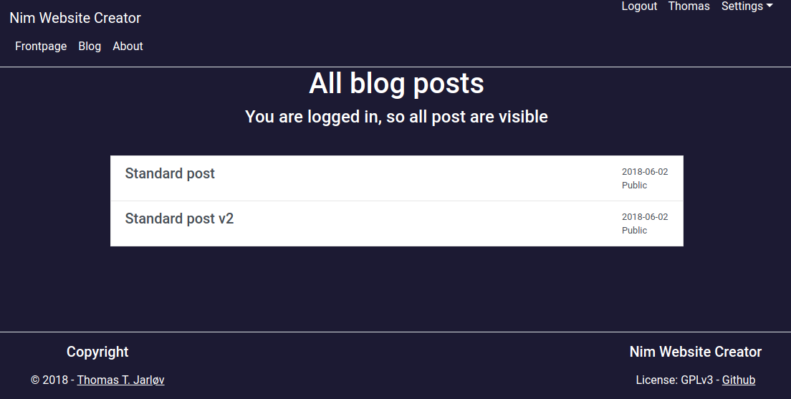
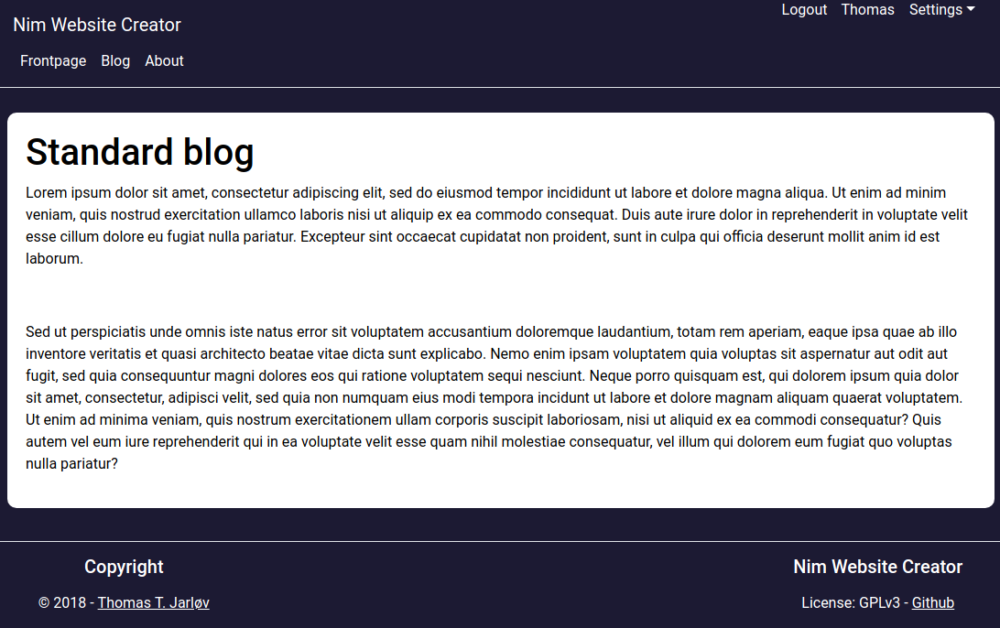
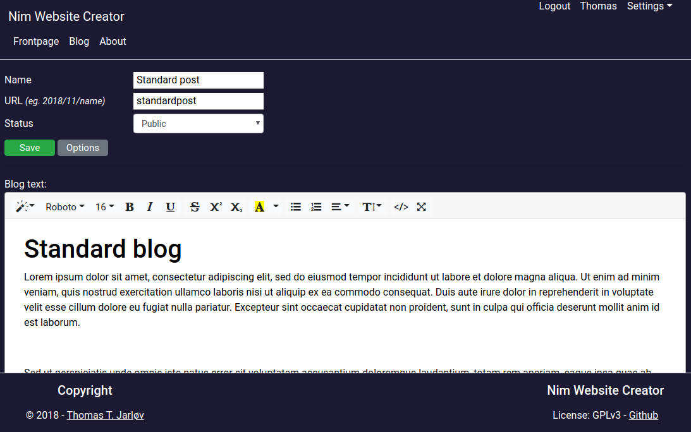
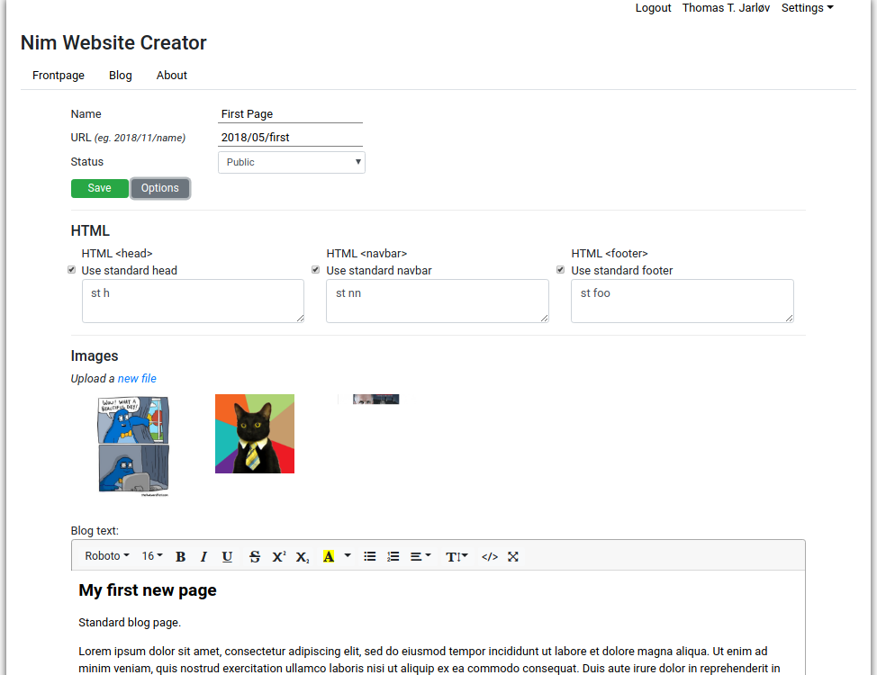
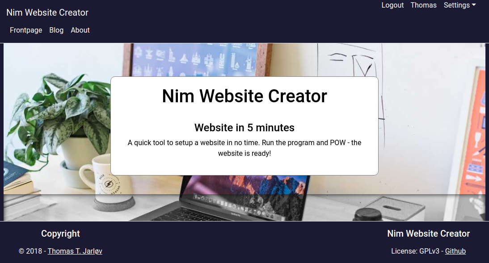
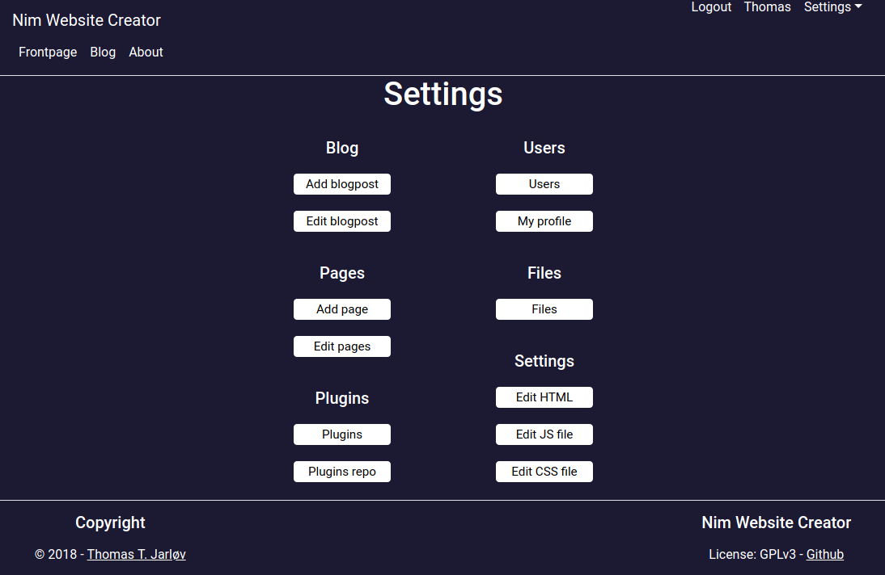
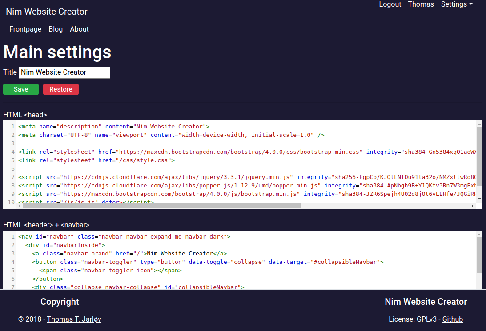
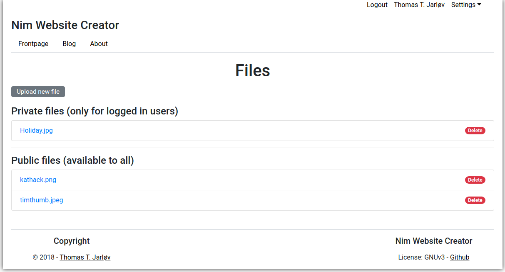
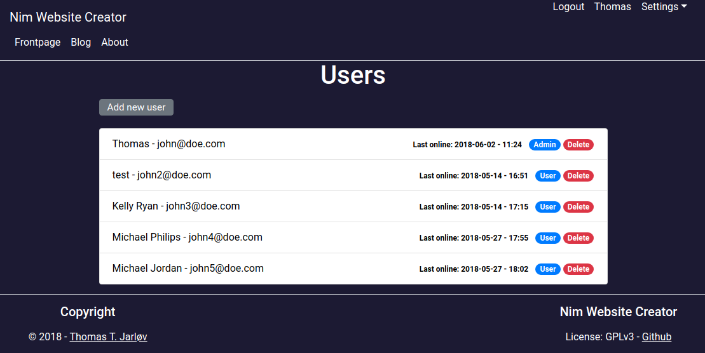
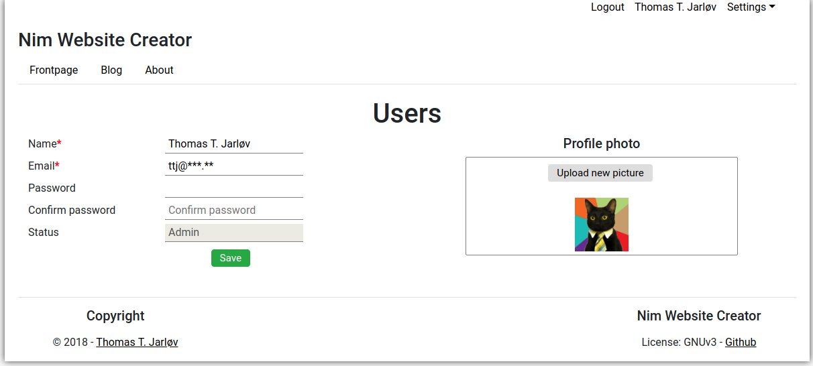

# Nim Website Creator

A quick website tool. Run the nim file and access your webpage.

Online test page: [Nim Website Creator](https://nimwc.org)


## Main features:
- Webserver hosting your page on 127.0.0.1:7000
- Blog - add and edit blog posts
- Pages - add and edit pages
- Custom head, navbar and footer
- Edit js/js.js and css/style.css
- Define your own JS and CSS imports
- Upload files (private or public)
- Multiple users
- Add plugins

## Requirements
- Linux
- Nim
- Nim modules (automated when using Nimble):
  - jester >= 0.2.0
  - reCAPTCHA >= 1.0.2
  - bcrypt >= 0.2.1


## Upgrading from 1.0.3
*Inspired by https://github.com/nim-lang/nimforum/*

Sessions is now used. Therefore, you need to make som changes to your database. This is only applicable if your database is created in versions below 1.0.4.

In the session table password has been renamed to key - this is essential. In the person table the VARCHAR length has been expanded to 300 from 110 - this is optional.

```
cd data
echo '.dump' | sqlite3 website.db > upgrade.dump
# Find and change:
# 1a) password varchar(110) not null
# to
# 1b) password varchar(300) not null,
#
# 2a) password $# not null,
# to
# 2b) key $# not null,
cat upgrade.dump | sqlite3 website.db
```


# Compiling / Installing

To compile and install you need [Nim](https://nim-lang.org/). You can easily install Nim using [choosenim](https://nim-lang.org/install_unix.html) with:
```
curl https://nim-lang.org/choosenim/init.sh -sSf | sh
```

You only need to perform 1a **or** 1b - not both of them.


## 1a) Install:

If you are using [Nimble](https://github.com/nim-lang/nimble) an executable will be generated and symlinked to `nimwc`, which then can be executed anywhere on your system.

```bash
# Install nimwc with nimble
nimble install nimwc

# Edit the config.cfg accordingly
# (change the confg.cfg path to your nimble folder and the correct package version)
nano ~/.nimble/pkgs/nimwc-0.1.0/config/config.cfg

# Run nimwc
# (to add an Admin user append "newuser": nimwc newuser)
nimwc
```


## 1b) Compile:

This will generate the executable in the folder. 

```bash
# Clone the repository
git clone https://github.com/ThomasTJdev/nim_nimwc
cd nim_nimwc

# Generate and edit the config.cfg accordingly
cp config/config_default.cfg config/config.cfg
nano config.cfg

# Compile nimwc
nim c -d:ssl nimwc.nim

# Run nimwc
# (to add an Admin user append "newuser": ./nimwc newuser)
./nimwc

# To recompile just add compileoption -d:rc
```


## Argument (args):

*These args should be prepended to file, e.g. ./nimwc newuser:*

* `newuser` = Add the Admin user. The `-u:<username>`, `-p:<password>` and `-e:<email>` args are required
  * `-u:<admin username>`
  * `-p:<admin password>`
  * `-e:<admin email>`
* `nginx` = Used to close the streaming connection when using nginx as a webserver
* `insertdata` = Insert standard data (this will override existing data)
* `newdb` = Generates the database with standard tables (does **not** override or delete tables). `newdb` will be initialized automatic, if no database exists.

## Compile options:

*These options are only available at compiletime:*

* `-d:nginx` = Used to close the streaming connection when using nginx as a webserver
* `-d:adminnotify` = Send error logs (ERROR) to the specified admin email
* `-d:dev` = Development
* `-d:devemailon` = Send email when `-d:dev` is activated
* `-d:demo` = Used on public test site [Nim Website Creator](https://nimwc.org)
* `-d:demoloadbackup` = Used with -d:demo. This option will override the database each hour with the file named `website.bak.db`. You can customize the page and make a copy of the database and name it `website.bak.db`, then it will be used by this feature.


# User profiles

There are 3 main user profiles:
* User
* Moderator
* Admin

The access rights below applies to main program. Plugins can have their own definition of user rights.

## User

The "User" can login and see private pages and blog pages. This user has no access to adding or editing anything.

## Moderator

The "Moderator" can login and see private pages and blog pages. This user **can** add and edit anything. The user **can** add and delete users, but cannot delete or add "Admin" users.

## Admin

The "Admin" has access to anything.


# Screenshots

Blog posts can be set as private or public.

**Blog**


**Blog page**


**Blog post edit 1**


**Blog post edit 2**


**Frontpage**


**Settings**


**Settings head, header & footer**


**Files**


**Users**


**Profile**



# Google reCAPTCHA

To activate Google reCAPTCHA claim you site and server key and insert them into you `config.cfg`.


# Standard plugins

These plugins are standard and available. *[They will be moved to separated repos in the future]*

### Enable/disable a plugin

To enable or disable a plugin go to `<webpage>/plugins`


### Plugin: Backup

Create an instant backup file. Schedule continuously backups. Download backups.

You can access the plugin at `/backup`.


### Plugin: Mailer

Add mailselements containing subject, description and a date for sending the mail. Every 12th hour a cronjob will run to check, if it is time to send the mail.

All registrered users will receive the email.

You can access the plugin at `/mailer`. This link can be added to the navbar manually.


### Plugin: Contact

A simple contact form for non-logged in users. The email will be sent to the info-email specified in the `config.cfg` file.

You can access the plugin at `/contact`. This link can be added to the navbar manually.


### Plugin: Themes

Switch between themes. Save custom themes from the browser.

You can access the plugin at `/themes`.


# Plugins

Plugins are loaded at compiletime with macros. Only plugins placed in the `plugins`-folder are included.

*Example plugins are available in the `plugins`-folder.*


## Plugin structure

A plugin needs the following structure:

```
mailer/
  - html.tmpl   (optional)
  - mailer.nim  (required)
  - routes.nim  (required)
  - plugin.json (required)
  - public/
    - js.js             (required) <- Will be appended to all pages
    - style.css         (required) <- Will be appended to all pages
    - js_private.js     (required) <- Needs to be imported manually
    - style_private.css (required) <- Needs to be imported manually
```

### plugin.json
This file contains information about the plugin. *(Standard plugins does not have this file)*

The file needs this formatting:
```JSON
[
  {
    "name": "templates",
    "foldername": "nimwc_templates",
    "version": "0.1",
    "url": "https://github.com/ThomasTJdev/nimwc_templates.git",
    "method": "git",
    "tags": [
      "templates"
    ],
    "description": "Full templates. Includes database, css, js and other public files.",
    "license": "MIT",
    "web": "https://github.com/ThomasTJdev/nimwc_templates"
  }
]
```


### mailer.nim
Includes the plugins proc()'s etc.

It is required to include a proc named `proc <pluginname>Start*(db: DbConn) =`

For the mailer plugin this would be: `proc mailerStart*(db: DbConn) =` . If this proc is not needed, just `discard` the content.


### routes.nim
Includes the URL routes.

It is required to include a route with `/<pluginname>/settings`. This page should show information about the plugin and any options which can be changed.


### *.js and *.css

On compiletime `js.js`, `js_private.js`, `style.css` and `style_private.css` are copied from the plugins public folder to the official public folder, if the files contains text.

The files will be renamed to `mailer.js`, `mailer_private.js`, `mailer.css` and `mailer<_private>.css`.

A `<link>` and/or a `<script>` tag to `mailer.css`/`mailer.js` will be appended to the all pages, if `js.js` or `style.css` contains text. The `private` files needs to be included manually.


## Plugin repo

To make plugin public accessible, you need to add it to the `plugins.json` in the [plugin repo](https://github.com/ThomasTJdev/nimwc_plugins).

Make a pull request where you have added your plugin data to `plugins.json`.

When you release a new version of your plugin, you need to increase the version in your plugin repo and in this repo. Otherwise the users will not notice, that your have release a new version.


# Trouble

Remove nimcache and nimwcpkg/nimcache and re-compile