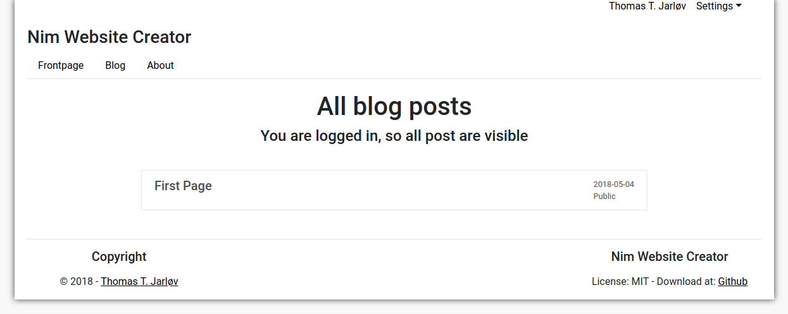
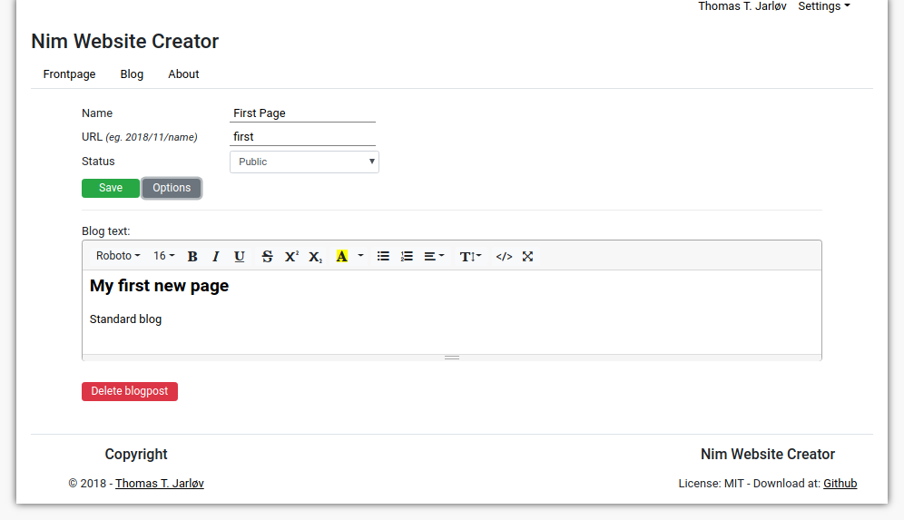
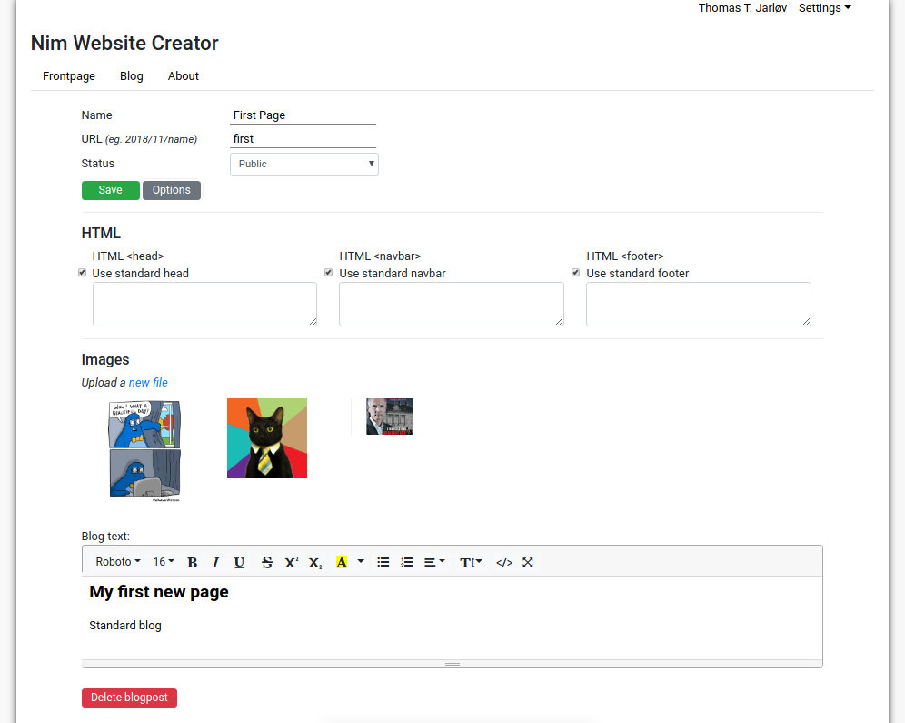
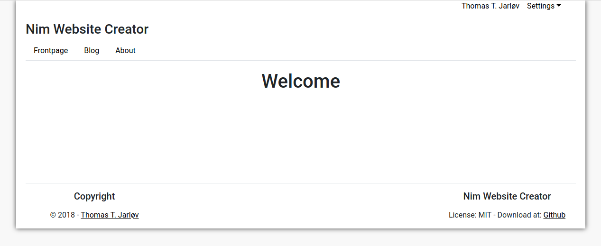
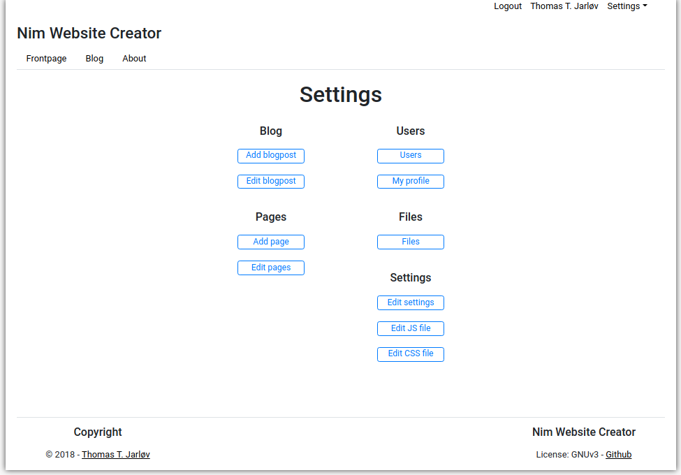
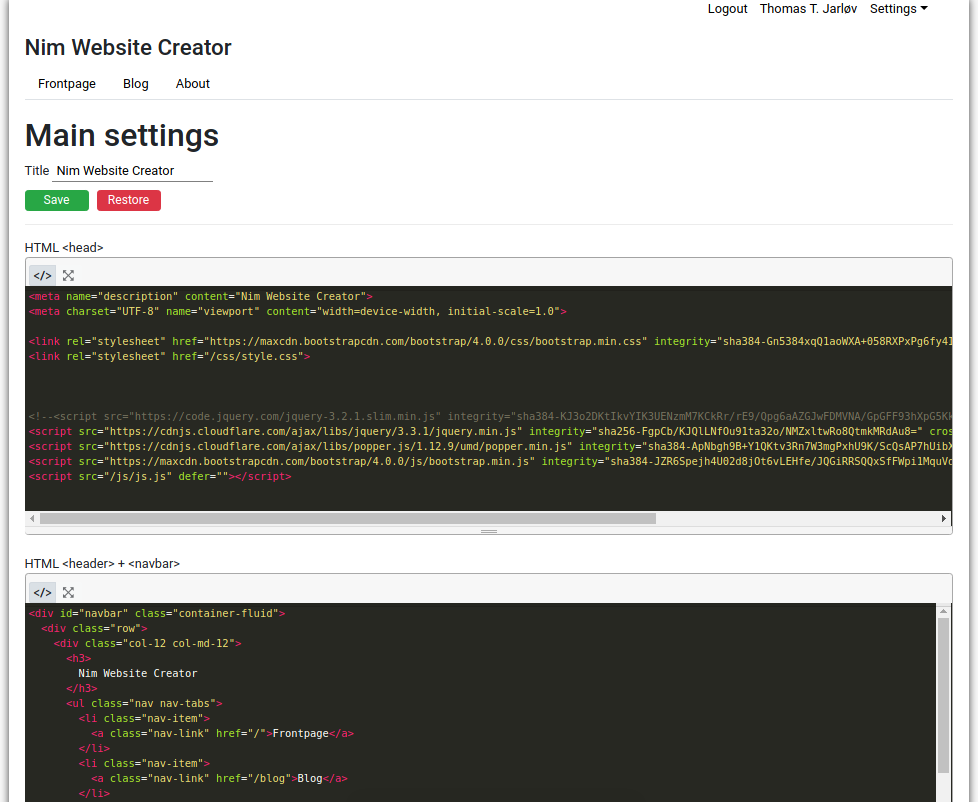
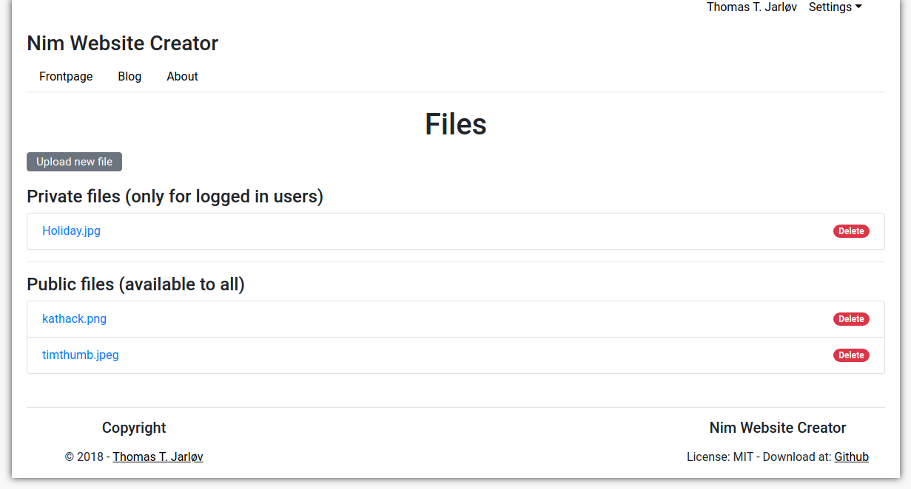
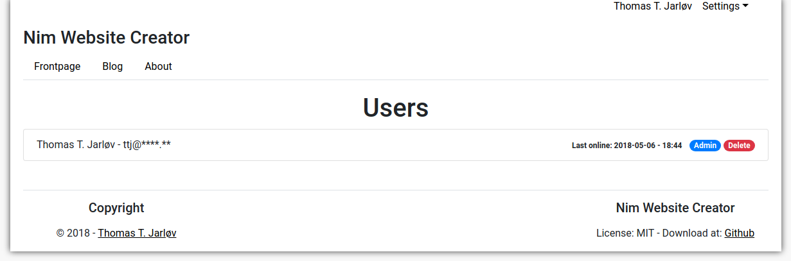
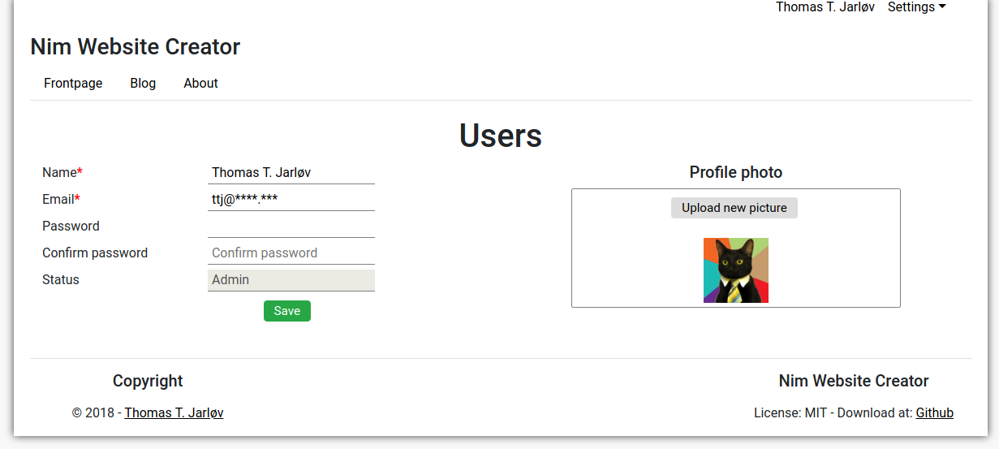

# Nim Website Creator

A quick website tool. Run the nim file and access your webpage.

## Main features:
- Webserver hosting your page on 127.0.0.1:7000
- Blog - add and edit blog posts
- Pages - add and edit pages
- Custom head, navbar and footer
- Define your own JS and CSS imports
- Upload files (private or public)
- Multiple users
- Edit js/js.js and css/style.css
- Add plugins

## Compile

#### Config:

Rename `config_default.cfg` to `config.cfg` and insert your data.

#### Compile:

`nim c -d:release -d:ssl websitecreator.nim`

### First run:

On the first run it is advised to use the parameters below, which will create the database, add an admin user and insert base data.

You can either compile with the program with parameters (-d:) or add the parameters as command line arguments.

#### Arguments

`./websitecreator.nim newdb newuser insertdata`

#### Compile first time

`nim c -r -d:release -d:ssl -d:newdb -d:newuser -d:insertdata websitecreator.nim`

#### Options:
* `-d:newdb` = Generate the database
* `-d:newuser` = Add an admin user
* `-d:insertdata` = Insert base data
* `-d:nginx` = Used to close the streaming connection when using nginx as a webserver
* `-d:dev` = Development
* `-d:devemailon` = Send email when `-d:dev` is activated

## Content

Blog posts can be set as private or public.

**Blog**


**Blog page**


**Blog post edit 1**


**Blog post edit 2**



## Screenshot

**Frontpage**


**Settings**


**Settings head, header & footer**


**Files**


**Users**


**Profile**



## Auto run forever

On a linux server `runwebsitecreator.sh` will ensure, that the program starts up in the case of a failure.

Can be run with nohup to hide output:
```
nohup ./runwebsitecreator.sh &
```


## Plugins

Plugins will be loaded at compiletime with macros. Plugins are placed in the `plugins`-folder. An example plugin (mailer) is available in the `plugins`-folder.

Plugins will be available at `www.example.com/<plugin-route-name>`

### Enable a plugin

To enable a plugin, add the plugin name and full path to `plugin/plugin_import.txt`. See the file for example.

Use the format:
```
pluginname:/home/full/path/to/plugin/folder/plugin_folder_name
# eg. for the mailer plugin:
mailer:/home/user/Documents/nim/nim_websitecreator/plugins/mailer
```

### Plugin structure

A plugin needs the following structure:

```
mailer/
  - html.tmpl   (optional)
  - mailer.nim  (required)
  - routes.nim  (required)
  - public/
    - js.js             (required) <- Will be appended to all pages
    - style.css         (required) <- Will be appended to all pages
    - js_private.js     (required) <- Needs to be imported manually
    - style_private.css (required) <- Needs to be imported manually
```

### mailer.nim
Includes proc's etc.

It is required to include a proc named `proc <pluginname>Start*(db: DbConn) =`. If this proc is not needed, just discard the content.

### routes.nim
Includes the URL routes.

### *.js and *.css

On compiletime `js.js`, `js_private.js`, `style.css` and `style_private.css` are copied from the plugins public folder to the official public folder, if the files contains text.

A `<link>` and `<script>` tag will be appended to the all pages, if `js.js` or `style.css` is active.

### Plugin: Mailer

Add elements containing mail subject, description and date for sending the mail. When the element is saved, every 12th hour a cronjob will run to check, if it is time to send the mail.

All registrered users will receive the email.

You can access the plugin at `/mailer`. The link can be added to the navbar manually.