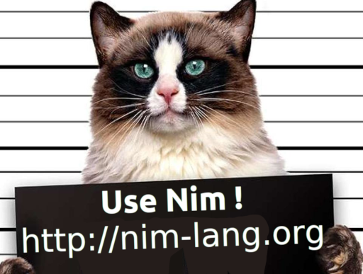

- Self-Firejailing Web Framework thats simple to use.

*Run it, access your web, customize, add plugins, deploy today anywhere.*

-----

# WAT?

*New Nim Web Framework*

- Write Blogs & Pages from browser, WYSIWYG/RAW
- Admin Dashboard, DevOps folder with resources on Git
- Plugin Store (inspired by Arch AUR, Cargo, PIP, etc)
- New functionality can be added via Plugins
- It can create a new Plugin (empty)
- Plugins can do whatever you want
- Fast & secure, Admin can really take control

-----

# Whats in the box?

*Not just another Web Framework...*

- Firejail is integrated in the Core (it Firejails itself)
- 2 Factor Authentication by default (TOTP, FreeOTP)
- [WebP](https://developers.google.com/speed/webp/docs/cwebp) automatic Image & Photo Optimization (~50% of JPG)
- [Libravatar/Gravatar](https://wiki.libravatar.org/libraries/#index2h1) automatic avatar photos (from user Mail)
- Editors are [Summernote](https://summernote.org), [CodeMirror](https://codemirror.net), [GrapesJS](https://grapesjs.com)
- Custom head, header, navbar, footer, title, meta tags, url, SEO friendly
- Upload/Download files & images with counter (private & public)
- Use MD5 CheckSum as filename on downloads (optional)
- Customize CSS, JS, HTML from browser, UX designer friendly
- ReCAPTCHA (optional)

-----

# Stack

- SQLite or Postgres database
- Bulma CSS framework by default (wont use any JS)
- Bootstrap CSS framework supported
- JavaScript framework agnostic
- No JavaScript framework shipped
- HTTP-Beast & Jester
- You can use Nim on the Frontend (Karax, NimX, etc)
- Nim covers the rest of the stack, Nim standard library

-----

# Nim Power

*Some people call it a "Python on Steroids"*

- Python like syntax, C like speed
- Nim can compile to JavaScript & WebAssembly for Frontend
- Nim can compile to C & C++ for Backend
- Compile to Python modules (theres Python modules on PyPI written on Nim)
- Seamlessly interoperate with C & C++ libs, even inlined C/Assembly
- Compile to NodeJS
- Compile-Time code execution, with FFI, JSON, IO, etc
- Code Hot Live Reload (rebuild & reload code on-the-fly)
- Nimble package manager & quickly growing number of libs
- LLVM Nim compiler, Vulkan, OpenGL, etc (from community)
- Nim has a Rust like mode (Memory Safety without GC)
- 7 Garbage Collectors to choose (Mark&Sweep, Bohem, Go, etc)
- Companies using it on Production (Nimbus, FragColor, etc)
- Nim is written on Nim (easy to hack into)
- No Single-Thread nor Global Interpreter Lock like other langs
- Use all your CPU 32 Cores!, Sized Types save RAM (int8, etc)

-----

# Admin Power

*Admin can really take control!*

- Choose how much CPU & Cores & RAM & SubProcesses NimWC can use
- Edit configuration from browser
- Edit Firejail from browser
- Log Viewer & Server Restart from browser
- Server Info page (Status page)
- Quick user Reset (without breaking users mail & password)
- Demo Mode, resets itself every 1 hour (for open public use)
- 4 Custom Isolated DNS Servers, custom isolated `hosts` file
- Isolation of X, sound, caches, etc. Hardware isolation
- Run with no root (No root privilege escalation because theres no root)
- Run with no Shell (No remote Shell access)
- You can compile without Firejail and without WebP (optional)

-----

# Some Screenshots

*Pic or didnt happen.*

-----

-----

-----

### Plugin Store

-----

# Future

- A lot of issues are feature plannings (roadmap)
- Material Design
- More documentation
- Better UI/UX
- More Plugins!
- ???

-----

# Thanks

Play with the Live Demo:
- https://nimwc.org/login

Learn Nim:
- https://nim-lang.org/learn.html

GitHub (this slides are there):
- https://github.com/ThomasTJdev/nim_websitecreator

*With &hearts; from the NimWC Team...*
